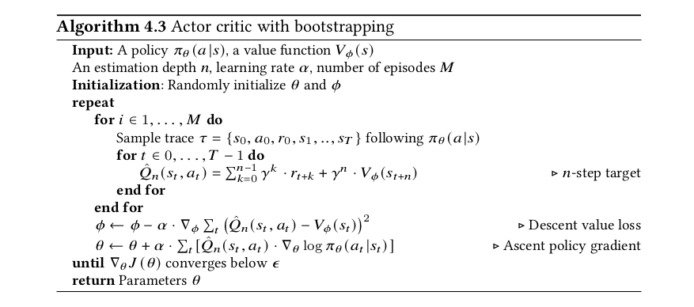
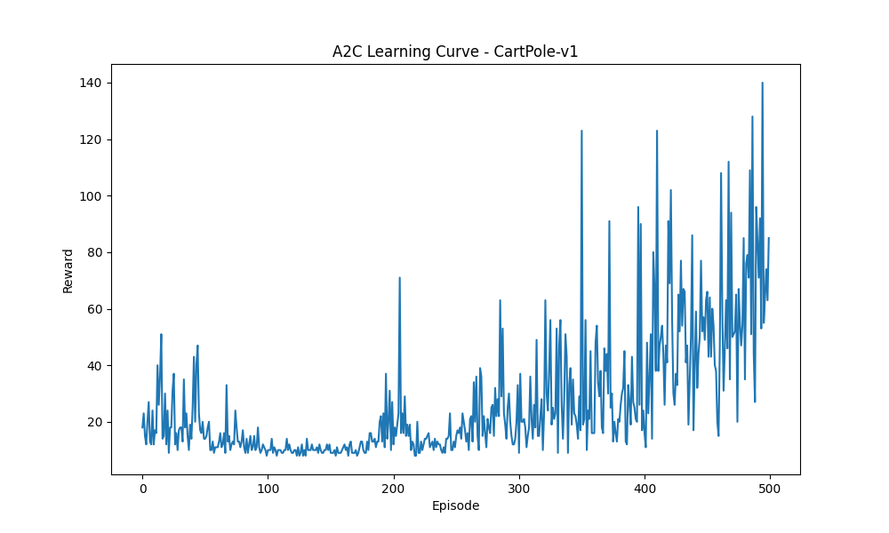

# A2C algorithm 

The variance of policy methods can originate from two sources: (1) high variance
in the cumulative reward estimate, and (2) high variance in the gradient estimate.




Consists of an actor and a critic network
They share a common structure
[]

input_env_states_dim, 128
128, output_action_dims
]

Actor takes an action, gets rewards (future accounted) to determine the advantage function
Advantage function is TD based.
````
# Train Function:
def train():
    Create env
    Intantiate the agent A2C
    for epi< epi_max
        state_0 = env.reset()
        for steps < max.steps:
            action= agent.get_action(state_0) # drawn from NN
            next_state, rewards , _ = env.step(action) # take action in env and get the outputs
            append state+, reward+, etc
            loss = agent.update # trace all the actions, states, rewards, next_states
````

````
# Actor_critic function
def Actor_critic():
    shared: NN
    forward : action(log_prob)
    critic : values

    get_action:
        action.item and log_prob(actions)
````

````
A2C function
def A2C():
    network
    optimizer
    convert states, actions, rewards, next_states, dones --> Tensors 
````

