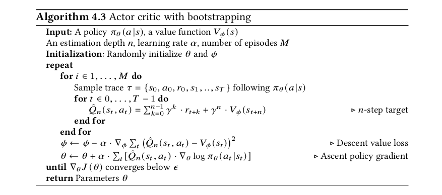
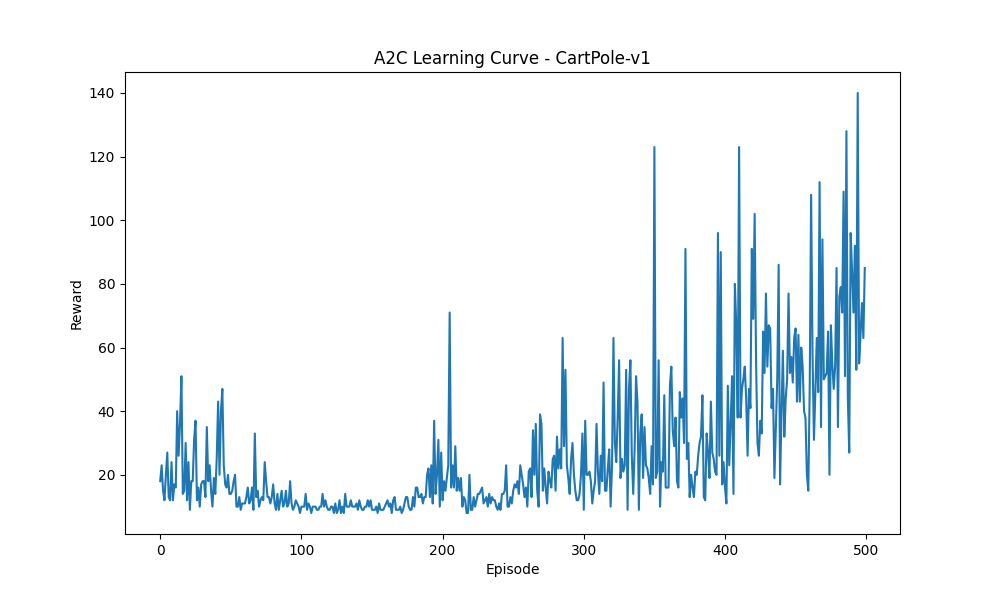

# A2C algorithm 


1. Actor Network: This network is responsible for learning the policy, which determines the agent's actions. It maps states to actions (or a probability distribution over actions in the case of stochastic policies). The actor decides "what to do" based on the current state, essentially learning how to act optimally.
2. Critic Network: This network evaluates the action taken by the actor by estimating the value function (e.g., the expected cumulative reward). It maps states (and sometimes actions) to a scalar value, representing how good the action or state is. The critic provides feedback to the actor, guiding its learning.


- The actor selects actions based on the current policy.
- The critic assesses the quality of those actions by estimating the value function (e.g., Q-value or state value).
- The actor uses the critic's feedback (e.g., advantage function or TD error) to update its policy, improving action selection over time.
- The critic updates its value estimates based on observed rewards and transitions to provide better feedback.


The variance of policy methods can originate from two sources: (1) high variance
in the cumulative reward estimate, and (2) high variance in the gradient estimate.




Consists of an actor and a critic network
They share a common structure
[]

input_env_states_dim, 128
128, output_action_dims
]

Actor takes an action, gets rewards (future accounted) to determine the advantage function
Advantage function is TD based.
````
# Train Function:
def train():
    Create env
    Intantiate the agent A2C
    for epi< epi_max
        state_0 = env.reset()
        for steps < max.steps:
            action= agent.get_action(state_0) # drawn from NN
            next_state, rewards , _ = env.step(action) # take action in env and get the outputs
            append state+, reward+, etc
            loss = agent.update # trace all the actions, states, rewards, next_states
````

````
# Actor_critic function
def Actor_critic():
    shared: NN
    forward : action(log_prob)
    critic : values

    get_action:
        action.item and log_prob(actions)
````

````
A2C function
def A2C():
    network
    optimizer
    convert states, actions, rewards, next_states, dones --> Tensors 
````

