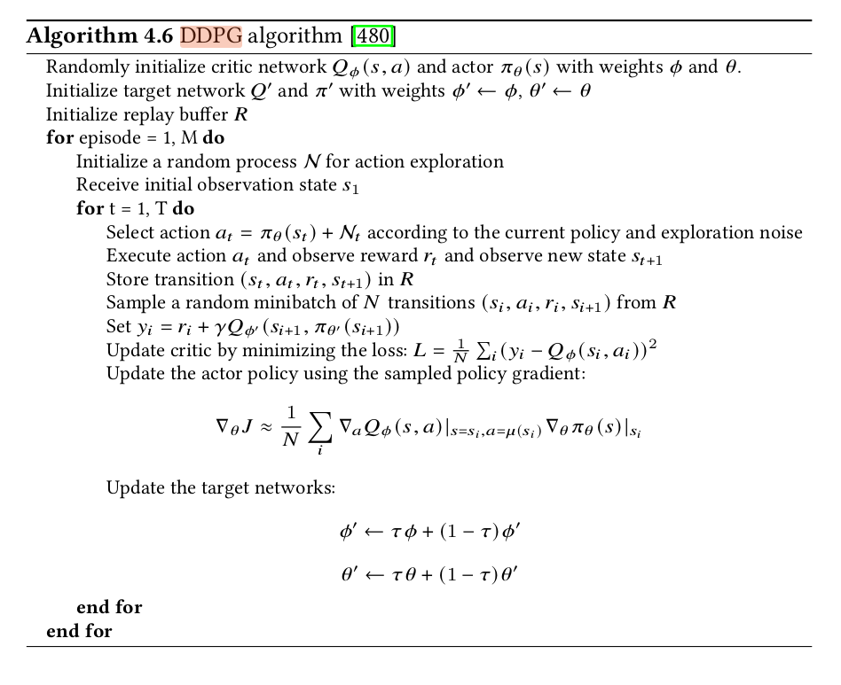
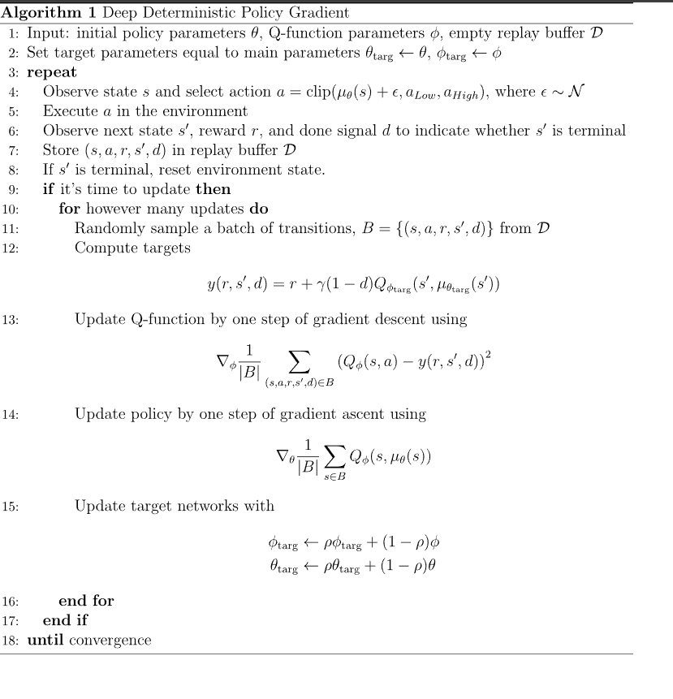

What is known of DDPG algorithm? 
-Model free off policy RL algo. Off policy meaning, it does not use the very next action-step value but uses a backup of these values and selects the max. Faster convergence
Similar to the Q-learning algorithm.

What are the advantages and disadvantages of such an algorithm?
-Uses 2 neural networks. 
One for the actor other for critic.

Unlike Q learning which uses

here the update is just the second term of the function using MSE (mean-squared error loss term)

DDPG is an off-policy algorithm. DDPG can only be used for environments with continuous action spaces. DDPG can be thought of as being deep Q-learning for continuous action spaces.

The bellman equation defines the optimal state for Q(s,a). Bellan Eq: Q_star(s,a)= E[r(s,a) + gamma* max(Q_star(s',a'))]

In most cases, the mean squared error term function determines how close it gets to satisfying the Bellmand equation:

Hence, Loss term= [Q(s,a)- (reward + gamma(1-d)* max(Q(s',a')))]^2

For actor network, the policy is updated using: max E[Q(s, actor(s))] In the code Mu is the symbol used for the actor network.

Since off policy use the replay buffers.

Parameters are updated using the Tau based delay.
