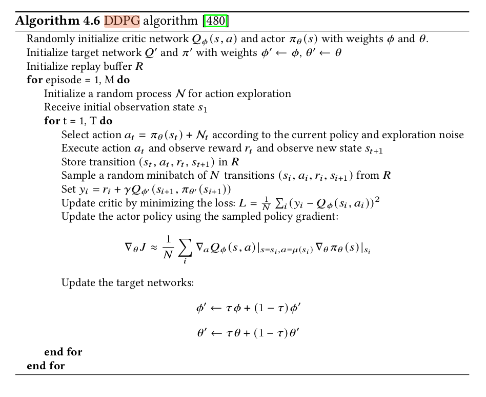
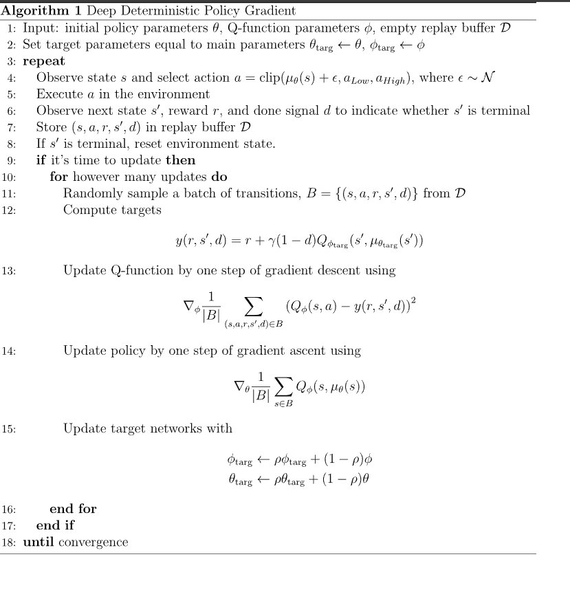

What is known of DDPG algorithm? 
-Model free off policy RL algo. Off policy meaning, it does not use the very next action-step value but uses a backup of these values and selects the max. Faster convergence
Similar to the Q-learning algorithm.

What are the advantages and disadvantages of such an algorithm?
-Uses 2 neural networks. 
One for the actor other for critic.

Unlike Q learning which uses

here the update is just the second term of the function using MSE (mean-squared error loss term)

