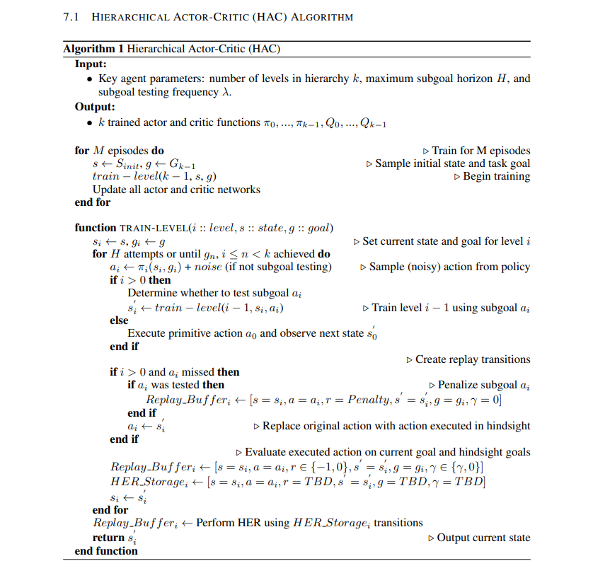

Mountaincar problem solved:
Reward is 100 for reaching the target of the hill on the right hand side, minus the squared sum of actions from start to goal.

This reward function raises an exploration challenge, because if the agent does not reach the target soon enough, it will figure out that it is better not to move, and won't find the target anymore.

Note that this reward is unusual with respect to most published work, where the goal was to reach the target as fast as possible, hence favouring a bang-bang strategy.

Position equal to 0.5. A constraint on velocity might be added in a more challenging version.

Get a reward over 90. This value might be tuned.

MountainCar-v0 defines "solving" as getting average reward of -110.0 over 100 consecutive trials.
This problem was first described by Andrew Moore in his PhD thesis [Moore90].