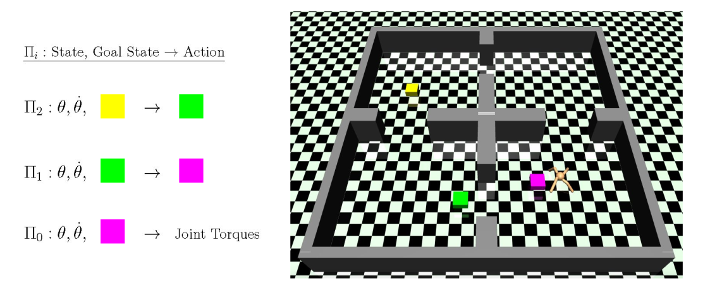
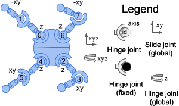

# Hierarchical Actor-Critc (HAC)
This repository contains the code to implement the *Hierarchical Actor-Critic (HAC)* algorithm- forked from https://github.com/andrew-j-levy/Hierarchical-Actor-Critc-HAC- 

Here is the algorithm:

An ant agent uses a 3-level hierarchy to traverse though rooms to reach its goal, represented
by the yellow cube. Π2 uses as input the current state (joint positions θ and velocities θ̇) and goal
state (yellow box) and outputs a subgoal state (green box) for Π1 to achieve. Π1 takes in the current
state and its goal state (green box) and outputs a subgoal state (purple box) for Π0 to achieve. Π0
takes in the current state and goal state (purple box) and outputs a vector of joint torques.

Implements
1. Universal Value Function Approximator (UVFA)
2. Hindsight Experience Replay

To run HAC,

*"python3 initialize_HAC.py --retrain"*.  

Typically run within the env folder. For example the ant_envs 
have repos containing the mujoco xml files.

If training on cluster modify the checkpoint txt file under the models folder for that environment to visualize the results. 
To view

*"python3 initialize_HAC.py --test --show"*.  

There are sample *"design_agent_and_env.py"* for each environment which contains initial state and other parameters. This needs to be created for each one seperately. 

The number of agents/steps that are to be trained can be modified by changing the FLAGS.layers = 3 , within design_agent_and_env.py file. 

Conda env used containing the dependencies are listed in *"environment.yml"*

The ant environment details for older versions can be found in here: 
https://gymnasium.farama.org/environments/mujoco/ant/

To show results of ant use code

''python3 initialize_HAC.py --test --show''

### 19/07/2025 - Ant reacher

The goal is defined with the and torso and velocity within certain coordinates and limits.

The action space of the ant env is given by:

Action Space: Box(-1.0, 1.0, (8,), float32)# torque values applied to the 4 joints
Observation Space: Box(-inf, inf, (105,), float64) #

Forces: 4 contact points with the floor and therefore the friction value

# Reward structure:

reward = healthy_reward + forward_reward - control_cost -contact_cost

# Why use sparse rewards based technique?
Realistic scenarios:
Sometimes you only know if the task succeeded or failed, not the "how well" at intermediate steps.

Simplifies reward design:
No need to handcraft detailed feedback functions.

Challenge for learning:
Since the agent rarely gets feedback, it encourages exploration and can lead to better generalization — but also makes training harder and slower.

Sparse rewards = reward only on success (or goal achievement), no intermediate signals.

Makes learning harder but sometimes more natural.

# Results of ant reacher?

2-level

3 -level

To-do:
Current running is limited to single cpu- takes couple of days on Ryzen 7 CPU. No GPU used. 

Reduce time used for running the code. 
Optimize for single core-CPU
Or use optimize for multiple-CPU running

Can it me made to use GPU?
