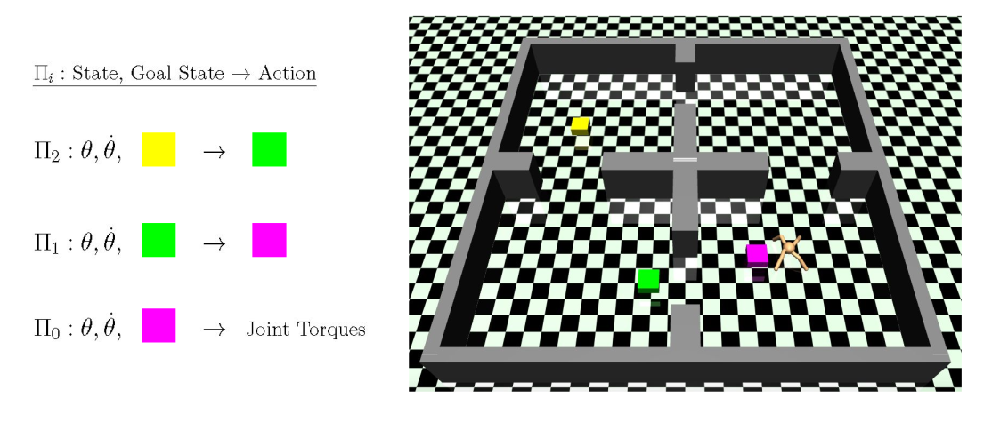
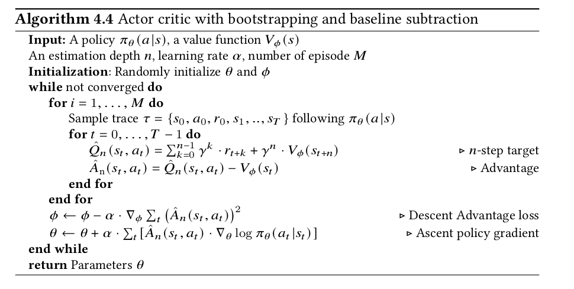

# Hierarchical-Actor-Critic-HAC-PyTorch

This is an implementation of the Hierarchical Actor Critic (HAC) algorithm described in the paper, [Learning Multi-Level Hierarchies with Hindsight](https://arxiv.org/abs/1712.00948) (ICLR 2019), in PyTorch for OpenAI gym environments. The algorithm learns to reach a goal state by dividing the task into short horizon intermediate goals (subgoals). 

Here is the algorithm:

An ant agent uses a 3-level hierarchy to traverse though rooms to reach its goal, represented
by the yellow cube. Π2 uses as input the current state (joint positions θ and velocities θ̇) and goal
state (yellow box) and outputs a subgoal state (green box) for Π1 to achieve. Π1 takes in the current
state and its goal state (green box) and outputs a subgoal state (purple box) for Π0 to achieve. Π0
takes in the current state and goal state (purple box) and outputs a vector of joint torques.

Implements
1. Universal Value Function Approximator (UVFA)
2. Hindsight Experience Replay

## Usage
- All the hyperparameters are contained in the `train.py` file.
- To train a new network run `train.py`
- To test a preTrained network run `test.py`
- For a detailed explanation of offsets and bounds, refer to [issue #2](https://github.com/nikhilbarhate99/Hierarchical-Actor-Critic-HAC-PyTorch/issues/2)
- For hyperparameters used for preTraining the pendulum policy refer to [issue #3](https://github.com/nikhilbarhate99/Hierarchical-Actor-Critic-HAC-PyTorch/issues/3)

## Implementation Details

- The code is implemented as described in the appendix section of the paper and the Official repository, i.e. without target networks and with bounded Q-values.
- The Actor and Critic networks have 2 hidded layers of size 64.

## Citing 

Please use this bibtex if you want to cite this repository in your publications :

    @misc{pytorch_hac,
        author = {Barhate, Nikhil},
        title = {PyTorch Implementation of Hierarchical Actor-Critic},
        year = {2021},
        publisher = {GitHub},
        journal = {GitHub repository},
        howpublished = {\url{https://github.com/nikhilbarhate99/Hierarchical-Actor-Critic-HAC-PyTorch}},
    }

## Requirements

- Python 3.6
- [PyTorch](https://pytorch.org/)
- [OpenAI gym](https://gym.openai.com/)

## Results

### MountainCarContinuous-v0
 (2 levels, H = 20, 200 episodes)  |  (3 levels, H = 5, 200 episodes)  |
:-----------------------------------:|:-----------------------------------:|
  |   |

 (2 levels, H = 20, 200 episodes)  |
:---------------------------------:|
 |

## References

- Official [Paper](https://arxiv.org/abs/1712.00948) and [Code (TensorFlow)](https://github.com/andrew-j-levy/Hierarchical-Actor-Critc-HAC-)

- 