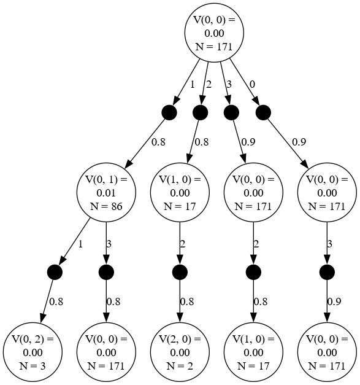
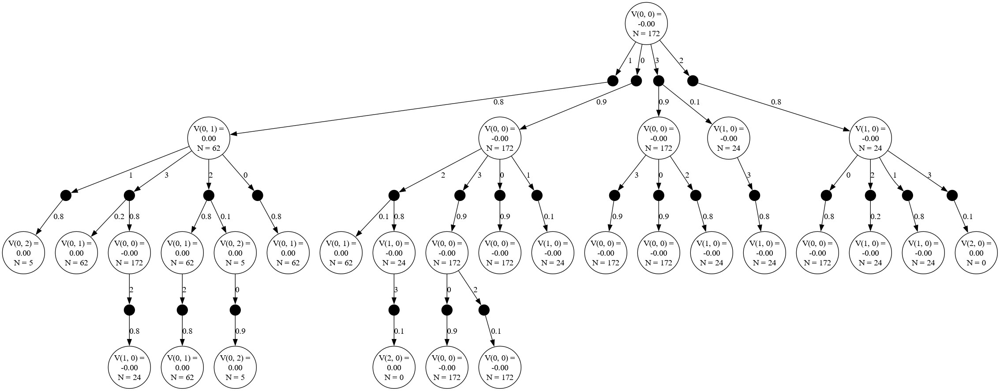
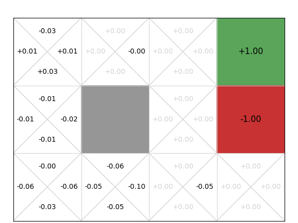
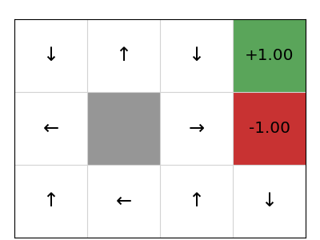
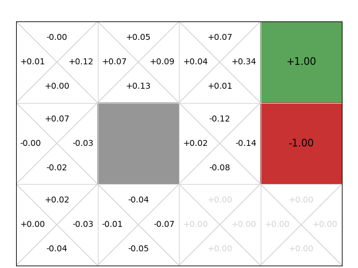

#   Steps involved
1. Initialize MCTS with environment and Q-function
2. Run mcts() for specified time
3. Selection phase navigates using tree policy (e.g., UCB)
4. Expansion adds new nodes to the tree
5. Simulation estimates value of new nodes
6. Backpropagation updates statistics along the path

Codes run
1. mcts_run.py

When running for gridworld problem, we see that there are four choices. Each action/choice (L, R, U, D)= [3, 2, 1, 0] would either lead to new state or stay in the same state.

When running the algorithm for a smaller duration of 0.01 s, we see only the first leaf is branched. 
Corresponding are the Value(state, action), N (number of times that node is visited), and the transition probabilities.

 

When running for 0.03 sec, we see a much expanded graph tree structure. Here one can the effect of slipping. 
As defined in Gridworld.py, the agent moves with Prob of 0.8 in the correct direction. While in prob of 0.1 and 0.1 slips in perp direction. 

After running for 10 sec the plot converges to what seems realistic. Here is the comparison with 0.3, 3.0 and 10.0.

# 0.3

# 3.0

# 10.0

