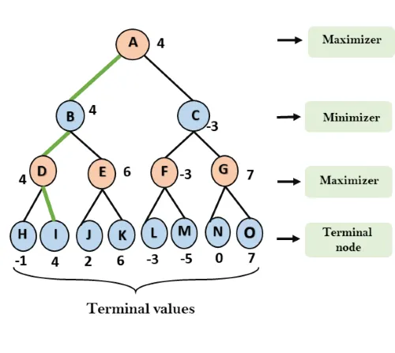
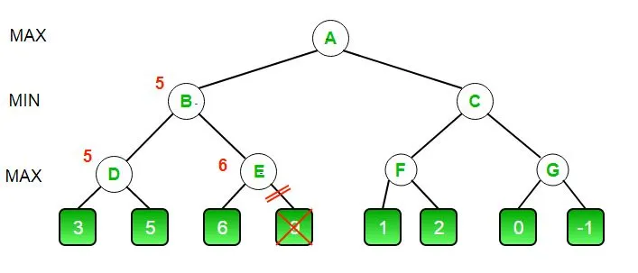
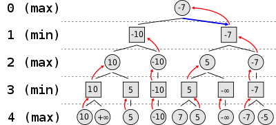
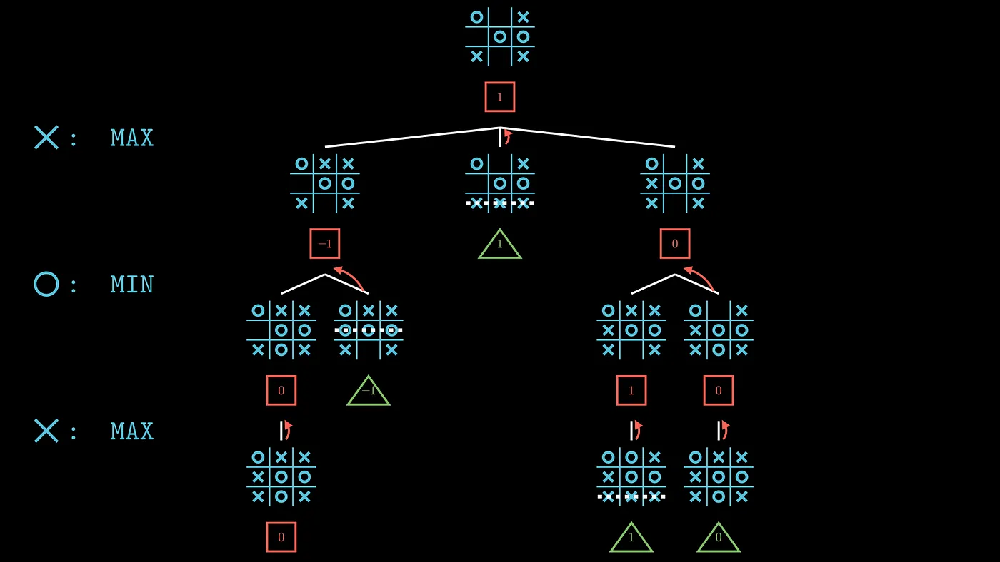
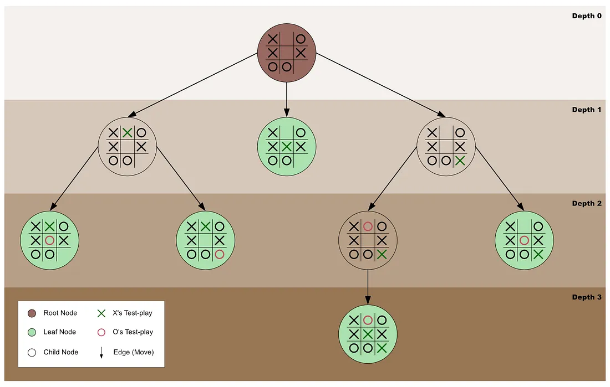

In Minimax algorithm, the optimal state is determined using a tree based method consisting of maximizing and minimizing the output for yourself and the opponent alternatively.
It assumes that the 2 opponents are working towards maximising their own output (fair game).
At the first stage (own interest), the different options are traversed. If it's a non terminal state, the further explored down. The next subsequent step would be in favour of opponent and hence it is the Minimize step.
The filtered values are escalated upwards towards the root node (first step-maximize) from the leaf nodes.
Example is shown for Tic Tac Toe. 

In the case of alpha-beta prunning, the steps to be explored are reduced to save time and resources. It is determined when there is a redundancy (the additional information from exploring a side branch is inconsequential for that particular row-either maximixe or minimize).
Overall, this function is good for basic and simpler versions of games. The complexity increases exponentially as it is deterministic in nature.

Code and images are from sources on the internet. 
https://papers-100-lines.medium.com/the-minimax-algorithm-and-alpha-beta-pruning-tutorial-in-30-lines-of-python-code-e4a3d97fa144
https://medium.com/@aidenrtracy/the-minimax-algorithm-f6e8e0a1eadb

Code can be run with command 
'''python3 Tictactoe.py'''

