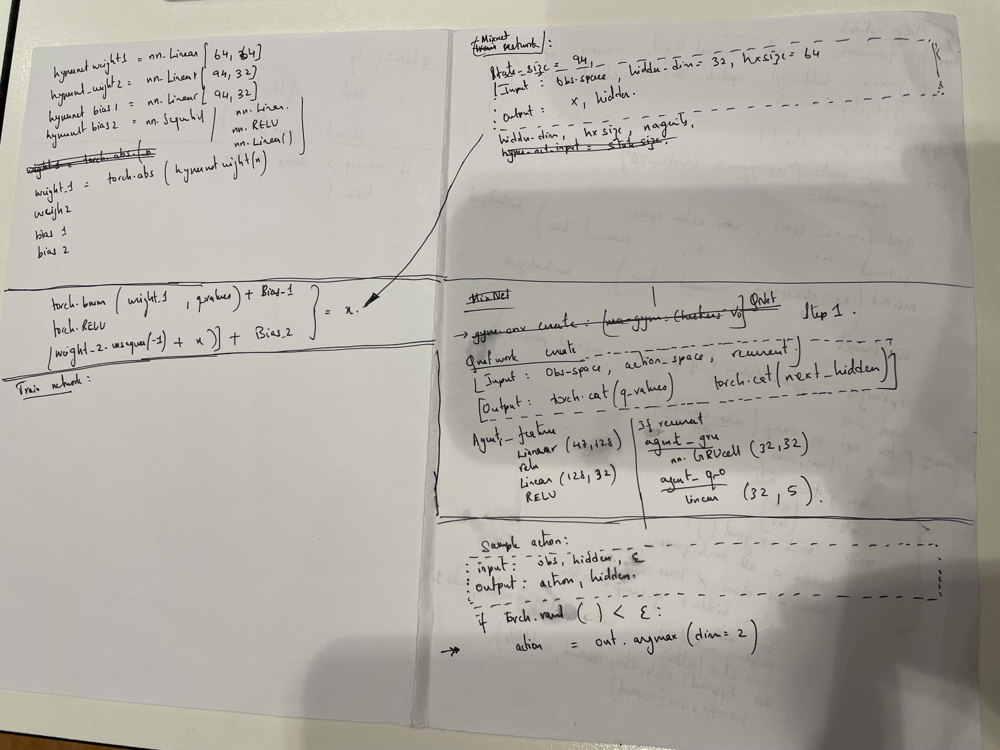

Reference taken from code: https://github.com/koulanurag/minimal-marl/blob/main/qmix.py

QMIX has add-on features on the mixing model. It has certain weights and biases which are added to the network states and a GRUcell which tracks memory functionality. The weights are added monotonically using the abs() value of the weights. 

Comparatively, VDN has simpler function for the estimation of the Q value actual. It takes the sum of the Q- values from the Q network which have max action value and compares it with Q values from target network. 

