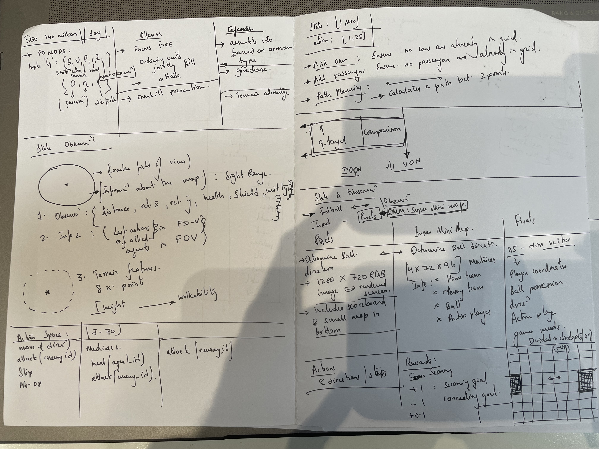
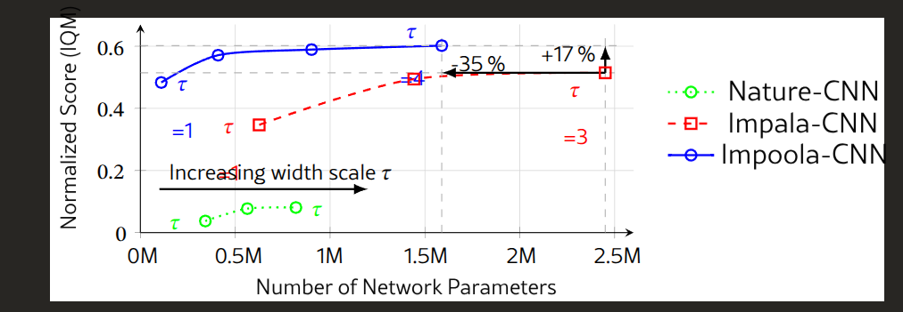
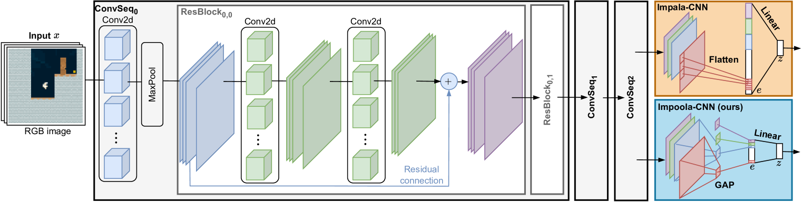

The current folder of Gfootball research only compiles with python3.10 or else the the docker container (More on that later).
Compiling on the python 3.10 allows one to start the ganme, however, it does not possible to run it with checkpoints. Attempts to compile with py 3.6 failed due to some missing libraries and possible C++ based dependencies. The trained model originally uses baselines which is pretty outdated and relies on tensorflow 1.15. This is unsupported in python 3.10 (dependency coming from python version).
The original game has an engine designed specifically for it. 

PPO or other models were attempted to be updated with stable_baselines3 which is more recent and uses pytorch. 

It uses the default AI based model as adversary for playing (C++ scripted).

Training on PPO based stable_baselines3. The function for training is based on a special case of CNN called impala network. This was included in the baselines repo, however was ommited in the more recent  stable_baslines3 folder. 

Below is the script for testing the human/player only mode and for training on stable_baselines3 module. 
There is however, some challenges in running the ppo model for training and further usage as adversary or further training. 

To install create python env 3.10 on conda running

``conda create -y -n gfootball310 python=3.10
conda create -y -n gfootball310 python=3.10``

Then run the following commands:

``sudo apt-get install git cmake build-essential libgl1-mesa-dev libsdl2-dev libsdl2-image-dev libsdl2-ttf-dev libsdl2-gfx-dev libboost-all-dev libdirectfb-dev libst-dev mesa-utils xvfb x11vnc python3-pip``

downgrade setuptools to install gym

``pip3 install setuptools==65.5.0``
# pip install -r requirements.txt 

Then upgrade again to install gfootball
``python3 -m pip install --upgrade pip setuptools psutil wheel
git clone https://github.com/google-research/football.git
cd football
python3 -m pip install .``

Update the GCC 
``conda install -c conda-forge libstdcxx-ng``
``python3 -m gfootball.play_game --action_set=full``

``sudo apt-get install -y gcc-10 g++-10
sudo apt-get install -y libstdc++6
strings /usr/lib/x86_64-linux-gnu/libstdc++.so.6 | grep GLIBCXX``

To run it against an AI adversary
```python3 -m gfootball.play_game --action_set=full```

To install stable_baselines3 and attempt to run against it

``pip3 install setuptools==65.5.0
pip install stable-baselines3==1.8.0
pip install wheel==0.38.4
pip install gym==0.21.0
python3 -m gfootball.examples.run_sb3_ppo --level=academy_empty_goal_close ``

To run test on different envs, use the following commands: 
``python3 test_env.py``

To save some images while training use:
``python3 -m gfootball.examples.run_sb3_ppo --dump_full_episodes=True --render=True``


1. Test Model Performance (No rendering, fast)
``python3 play_vs_sb3_model.py ./ppo_sb3_gfootball.zip test``


2. Watch AI vs AI (Both teams controlled by your model)
``python3 play_vs_sb3_model.py ./ppo_sb3_gfootball.zip ai-vs-ai``


3. Play Against the AI (You vs AI - default mode)
``python3 play_vs_sb3_model.py ./ppo_sb3_gfootball.zip human-vs-ai``


4. Play on Different Level:
``python3 play_vs_sb3_model.py ./ppo_sb3_gfootball.zip ai-vs-ai academy_empty_goal_close``


5. To simply test the model with rendering
``python3 load_sb3_model.py``


Some explanation about the extracted vs extracted stacked frameworks: 

## "extracted" (without stacking)
Representation: Uses the "extracted" representation (also called "super minimap" or SMM)
Observation format: 4-channel visual representation with dimensions (72, 96, 4)
Channels:
Channel 1: Left team player positions
Channel 2: Right team player positions
Channel 3: Ball position
Channel 4: Active player position
Temporal information: Only current frame (no history)

## "extracted_stacked" (with stacking)

Representation: Same "extracted" representation as above
Observation format: 16-channel visual representation with dimensions (72, 96, 16)
Channels: Same 4 channels as above, but stacked over 4 consecutive frames
Temporal information: Contains information from the last 4 frames concatenated along the channel dimension

## Temporal context

Why use stacking?
Frame stacking is crucial for reinforcement learning in dynamic environments because:
Motion detection: The agent can see how players and the ball are moving
Velocity information: Direction and speed of movement
Temporal patterns: Sequences of actions and their consequences
Better decision making: More context for making informed decisions


To train and AI model:

```bash ./run_sb3_ppo_script.sh```

To run or play against and AI model run the commands

```python3 -m gfootball.play_game --players "keyboard:left_players=1;ppo_sb3:right_players=1,checkpoint=/home/skr3178/Downloads/football/gfootball/examples/ppo_sb3_gfootball_impala_params.zip" --level=11_vs_11_easy_stochastic```

## Docker

Docker files are updated as.


To start the container use the command ``run_docker_test.sh``
The command ``docker run -v /tmp/.X11-unix:/tmp/.X11-unix:rw  --entrypoint python3 -it gfootball_docker_test gfootball/examples/run_ppo2.py --level=academy_empty_goal_close --num_timesteps=10000``
will start running the gfootball, however it does not render

Start the container by running
``docker run -it   -e DISPLAY=$DISPLAY   -v /tmp/.X11-unix:/tmp/.X11-unix:rw   --entrypoint /bin/bash   gfootball_docker_test``

Inside the docker container:

``apt update
apt install -y x11-apps
xeyes``

Error when running the command inside the container:

``root@a27d4be42fd3:/gfootball# python3 -m gfootball.play_game --action_set=full``

``
libGL error: MESA-LOADER: failed to retrieve device information
libGL error: MESA-LOADER: failed to open nvidia-drm (search paths /usr/lib/x86_64-linux-gnu/dri:\$${ORIGIN}/dri:/usr/lib/dri)
libGL error: failed to load driver: nvidia-drm
libGL error: No matching fbConfigs or visuals found
libGL error: failed to load driver: swrast
X Error of failed request:  GLXBadContext
  Major opcode of failed request:  152 (GLX)
  Minor opcode of failed request:  6 (X_GLXIsDirect)...
``

Rewards Model


Reference: class CheckpointRewardWrapper(gym.RewardWrapper)/ [gfootball/env/wrappers.py]

##Update: 
Running the original code as is with python 3.6 and compilation.
Started running on container ubuntu 18.04 as noted here: dorowu/ubuntu-desktop-lxde-vnc
https://hub.docker.com/r/dorowu/ubuntu-desktop-lxde-vnc/
start the container with command 

``sudo docker run -d   --name ubuntu-lxde-bionic   -p 6080:80   -e RESOLUTION=1920x1080   -v /dev/shm:/dev/shm   -v $HOME/docker-data/ubuntu-vnc:/home/ubuntu   dorowu/ubuntu-desktop-lxde-vnc:bionic
``

In code subprocess env is set up. It creates multiple environments such that they can be trained in parallel.

Reference: ``football/gfootball/env/__init__.py``

Stacking: Using the last 4 observation instead of the typical 1 layer of observations

Here is what the obs matrix dimensions looks like when using representation= 'extracted_stacked'
Your observation shape [72, 96, 16] is exactly what you should get for extracted_stacked (SMM with 4-frame stacking). If you use just extracted (no stacking), the shape would be [72, 96, 4].

When running the representation as "pixel_gray": obs shape changes to [72, 96, 1]
as "pixel": obs shape changes to [72, 96, 3]
as "extracted": obs shape changes to [72, 96, 4]
Table 

|Representation	    | What is it?	              | SMM?| Full Rendered Game?
|pixels	Rendered    | RGB image	                | No	| Yes
|pixels_gray	      | Rendered grayscale image	| No	| Yes
|extracted	        | Super Mini Map (SMM)	    | Yes	| No
|extracted_stacked	| Stacked SMM (4 frames)    | Yes	| No

|SMM -      |   4 planes|
____________________________________________________________________________
|P1 plane1  |   Left team, binary values [0/255] player present or absent
|P2 plane2  |   Right team, binary values [0/255] player present or absent
|P3 plane3  |   Position of  ball, binary values [0/255] ball present or absent
|P4 plane4  |   Active player, binary values [0/255] PLayer active or not 

Simple115 mode is for MLP perceptron which is a simple 115 length vector for each agent.
_________________________________________________________________________________________
  22 (11 players pos× 2 coord (x, y)-left pos) + 22 (left dir 11x2 (x, y)) 
+ 22 (11 players pos× 2 coord (x, y)-right pos) + 22 (right dir 11x2 (x, y))
+ 3 (ball pos(x, y, z)) + 3 (ball dir (x, y, z)) 
+ 3 (ownership ([1, 0, 0] (no one), [0, 1, 0] (left), [0, 0, 1] (right)))
+ 11 (active from the left/controlled team) 
+ 7 (game mode: Normal, KickOff, GoalKick, FreeKick, Corner, ThrowIn, Penalty)
= 115

Reward design 
Reference: ``/football/gfootball/env/football_env_core.py``

1. Sparse (liekly takes longer to learn): +1 for scoring, -1 for conceding

2. Checkpoints: rewards laid out for moving forward the ball into opponents half and making progress.

Feature	              |  Value/Logic
---------------------------------------------------------------------------
Number of checkpoints |	 10 (default)
Reward per checkpoint |	 0.1 (default)
When rewarded?	      |  Ball crosses a new checkpoint, or scores
Who is rewarded?	    |  Only if active player on left team has ball
Bonus on goal?	      |  Yes, all remaining checkpoint rewards

Based on threshold and ball positions, the reward is collected:

d is the tracking system used to determine how close the ball is to the opponent’s goal.

d= (x ball​ −1)^2 +(y ball​ −0) ^2

​If d is within threshold (decreases with increasing checkpoints collected), reward is added with checkpoint_reward of 0.1. 

The impala CNN architecture is shown to perform relatively better than regular/natural CNN.
Reference: "Impoola: The Power of Average Pooling for Image-Based Deep Reinforcement Learning"





