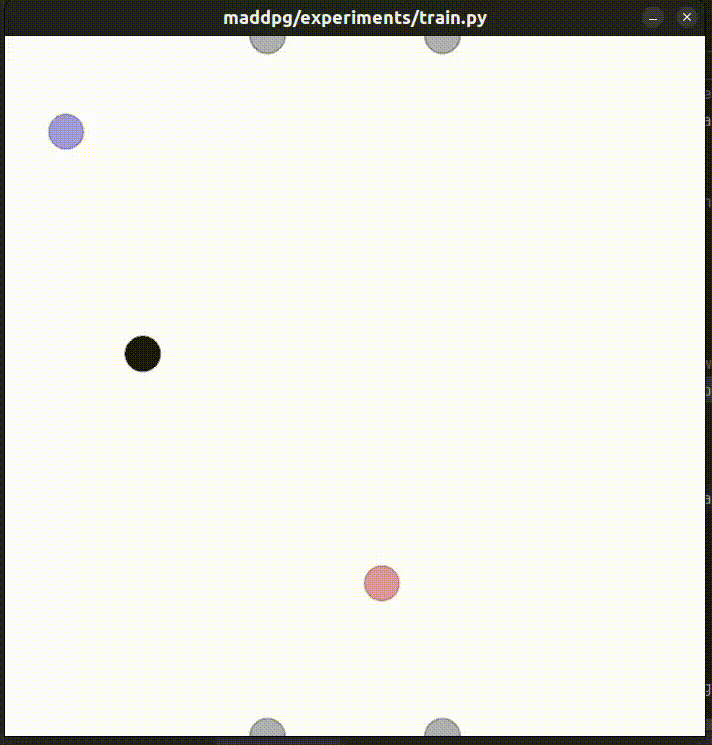

## Report 
Note: the air hockey game as developed in this code is not typical rule based one. 
Additional game design terms on restitution had to be explicitly be modelled into it. 

The puck starts at random location. The game uses a simple NN instead of specific forms such as ddpg hence the rewards are of lower value.

# Describe the reward system you designed.

The current reward designed is based on an adversial-zero sum game approach
First the reward for the "good" agent is designed such that the bring proximity (reduce mean square distance) between the puck.pos and the agent.pos
This drives the agent straight to the puck. 

Thereafter, the reward is based on bringing the puck through/across the goal posts.  
This means the puck.pos at y-value 1.0 and x value between (-0.25, 0.25) is rewarded aggressively. 
This adds within training a huge impetus to push the puck through the goal posts. 

For the adversary, the same reward is designed however in vice versa. 
There is no communication between the agents (non-cooperative behavior).

## REWARDS consists of 3 parts: 

1. **Proximity based reward.** Pushes the agent to be as close as possible to the puck.
rew = -10 * np.sqrt(np.sum(np.square(agent.state.p_pos - world.landmarks[0].state.p_pos)))


2. **Velocity alignment term** (dot product) between the puck and the agent. This way the puck is moving forward by the agent. 
alignment_score = np.dot(agent_vel, puck_vel) / ( np.linalg.norm(agent_vel) * np.linalg.norm(puck_vel))


3. **Goal score/concede.**

Scoring adds +30 to reward while conceding subtracts a -30 to reward.
            
````
    def agent_reward(self, agent, world):
        # Position checks
        y_pos = agent.state.p_pos[1]

        # Base reward: puck proximity (scaled up)
        # Equivalent to: (x2-x1)² + (y2-y1)² (no square root)
        rew = -10 * np.sqrt(np.sum(np.square(agent.state.p_pos - world.landmarks[0].state.p_pos)))

        # physics based puck return velocities
        puck_vel = world.landmarks[0].state.p_vel
        agent_vel = agent.state.p_vel

        # Velocity alignment term (dot product of agent and puck velocities)
        velocity_alignment = np.dot(agent_vel, puck_vel)

        # Normalize by magnitudes to get directional alignment (range: [-1, 1])
        if np.linalg.norm(agent_vel) > 0.1 and np.linalg.norm(puck_vel) > 0.1:
            alignment_score = velocity_alignment / (
                    np.linalg.norm(agent_vel) * np.linalg.norm(puck_vel)
            )
        else:
            alignment_score = 0  # Ignore if velocities are too small
        rew += alignment_score

        # Goal detection
        puck_x, puck_y = world.landmarks[0].state.p_pos
        if -0.25 <= puck_x <= 0.25:  # Within goal width
            if (puck_y >= 1.0):
                rew += 30  # Scored goal
            elif (puck_y <= -1.0):
                rew -= 30  # Conceded goal

        return rew

    def adversary_reward(self, agent, world):
        y_pos = agent.state.p_pos[1]
        initial_y = agent.initial_y

        # Base reward: puck proximity (scaled up)
        rew_2 = -10 * np.sum(np.square(agent.state.p_pos - world.landmarks[0].state.p_pos))

        # physics based puck return velocities
        puck_vel = world.landmarks[0].state.p_vel
        agent_vel = agent.state.p_vel

        # Velocity alignment term (dot product of agent and puck velocities)
        velocity_alignment = np.dot(agent_vel, puck_vel)

        # Normalize by magnitudes to get directional alignment (range: [-1, 1])
        if np.linalg.norm(agent_vel) > 0.1 and np.linalg.norm(puck_vel) > 0.1:
            alignment_score = velocity_alignment / (
                    np.linalg.norm(agent_vel) * np.linalg.norm(puck_vel)
            )
        else:
            alignment_score = 0  # Ignore if velocities are too small
        rew_2 += alignment_score

        # Goal detection
        puck_x, puck_y = world.landmarks[0].state.p_pos
        if -0.25 <= puck_x <= 0.25:  # Within goal width
            if (puck_y <= -1.0):
                rew_2 += 30  # Scored goal
            elif (puck_y >= 1.0):
                rew_2 -= 30  # Conceded goal

        return rew_2 # True zero-sum
````

• How well do the agents perform after training? Discuss your results and relate them
to your reward system design.

At first without the rewards designs explicitly with the goal posts, the agents just seem to compete for the puck without a goal, reducing the distance.
The puck velocity is not explicitly modeled into the code.



Here the puck velocity is modeled as well as the goal detection and velcoity allignment terms


Here the walls are made such that the puck, agent and adversary agents bounce off by restitution terms.


• Are the agents equally good? Can you see any reason/explanation why they would not
be?
The agents seem to be almost equally good, but the initial position of the puck (assigned randomly) means that one of the agents is always closer to the puck.  
Therefore this leads to a slight bias/ advantage disadv condition between the agents. 


• **How do you think the length of episodes and size of the hockey rink would affect learning for your choice of reward system?**

Episode length:
-Longer episodes are able to run the program such that the end reward is accomodated and seen more often. That way the goal becomes more distinct. 
-Shorter episodes may not capture the scenario of the reward function being updated with the goal (final reward).

**Size of the hockey ring:??**

